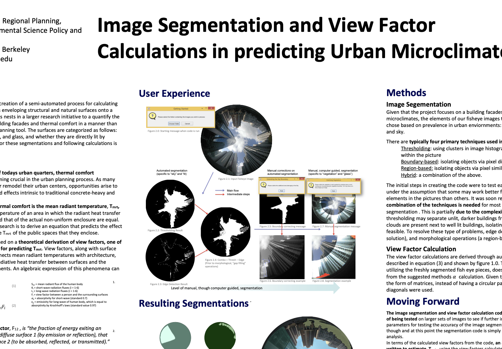

<head>

</head>

<body>
 
<strong>Position:</strong> Intern at the Chinese University of Hong Kong through the Cal Energy Corps Program.  
 
<strong>Assignment:</strong> To create a matlab script that would ingest fisheye images of courtyards
and segment the image by the different materials and objects (sky, vegetation, concrete, etc.) shown 
in it. Furthermore, based on the space that each material occupied in the image, my code
would then do a view factor analysis to estimate each materials impact on the area's temperature. 
This work was done for Professor Edward Ng, whose team used these images
in their urban heat island effect study looking into the impact of different building materials. 
 
<strong>Date:</strong> Summer 2015  
 

  
  
 <a style="color:white;" href="pdfs/hkposter.pdf">poster</a> 

  
  
 <a style="color:white;" href="https://hkbyrn.wordpress.com">blog</a> 

 
 
 

</body>

