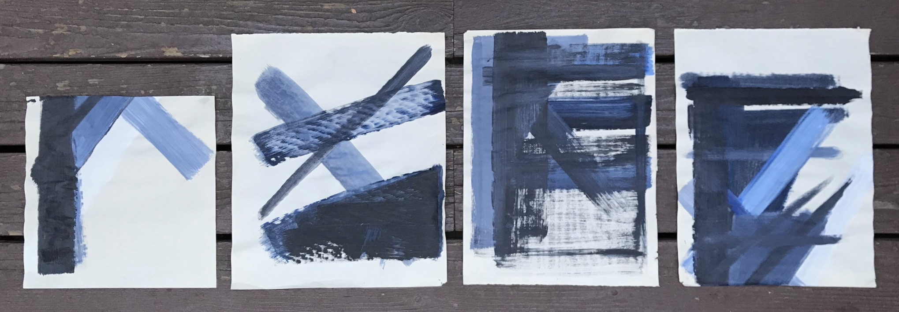

<body>

 
 

Resume, <a href="pdfs/neuhausler_resume.pdf" >open pdf</a>

 

<embed src="pdfs/neuhausler_resume.pdf" width="80%" height="550" type="application/pdf">

 
 
 
 

Portfolio and C.V. available upon request

<figure>

<figcaption>
 </figcaption>
</figure>

 
 
 
 

</body>
